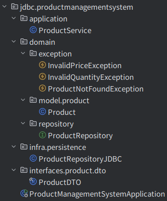

# 기능 요구사항

1. 상품 등록
2. 등록된 상품 조회
3. 상품 정보 수정
4. 상품 삭제

## 상품 등록

### 기능

1. 사용자는 메인 페이지의 상품 등록 버튼을 클릭한다.
2. 사용자는 상품 등록 폼의 상품 이름, 가격, 수량을 입력한다.
3. 시스템은 해상 상품을 등록한다.

### 사후조건

- 사용자는 메인 페이지로 돌아가야 한다.
- 등록된 상품이 영속성 저장소에 저장되어야 한다.

## 등록된 상품 조회

### 사전조건

- 사용자가 메인 페이지에 접근해야 한다.

### 기능

- 등록된 모든 상품과 가격, 남은 재고를 보여준다.

### 사후조건

- 영속성 저장소에 존재하는 모든 데이터가 메인 페이지의 목록에 보여야 한다.

## 상품 정보 수정

### 기능

1. 사용자는 메인 페이지의 상품 수정 버튼을 클릭한다.
2. 사용자는 상품 정보 수정 폼의 상품 이름, 가격, 수량을 입력한다.
3. 시스템은 해당 상품의 정보를 수정한다.

### 사후조건

- 사용자는 메인 페이지로 돌아가야 한다.
- 등록된 상품의 값이 영속성 저장소에서 변경되어야 한다.

## 상품 삭제

### 기능

1. 사용자는 메인 페이지의 상품 삭제 버튼을 클릭한다.

### 사후조건

- 사용자는 갱신된 메인 페이지를 볼 수 있어야 한다.
- 등록되었던 상품이 영속성 저장소에서 제거되어야 한다.

# 도메인 모델
```mermaid
classDiagram
	class Product{
		-id: int
		-productName: String
		-quantity: int
		-price: int
		+changeQuantity(int): void
		+changeName(String): void
		+changePrice(int): void
	}
```

# UML 클래스 다이어그램
```mermaid
classDiagram
	class Product{
		-id: int
		-productName: String
		-quantity: int
		-price: int
		+changeQuantity(int): void
		+changeName(String): void
		+changePrice(int): void
	}
	class ProductService {
        +createProduct(Product product): Product
        +findProductById(Long id): Optional~Product~
        +findAllProducts(): List~Product~
        +changeName(Long id, String name): Product
        +changeQuantity(Long id, Long quantity): Product
        +changePrice(Long id, Long price): Product
        +deleteProduct(Long id): void
    }

    class ProductRepository {
        <<interface>>
        +save(Product product): Product
        +findById(Long id): Optional~Product~
        +findAll(): List~Product~
        +deleteById(Long id): void
    }
    class ProductRepositoryJDBC {
        +save(Product product): Product
        +findById(Long id): Optional~Product~
        +findAll(): List~Product~
        +deleteById(Long id): void
    }
    class ProductController{
    }
    ProductService --> ProductRepository : 사용
    ProductService --> Product : 조작
    ProductRepository --> Product : 영속화
    ProductRepositoryJDBC ..|> ProductRepository: 구현
    ProductController --> ProductService : 사용
    ProductController --> ProductDTO : 조작
```
# 패키지 구조
